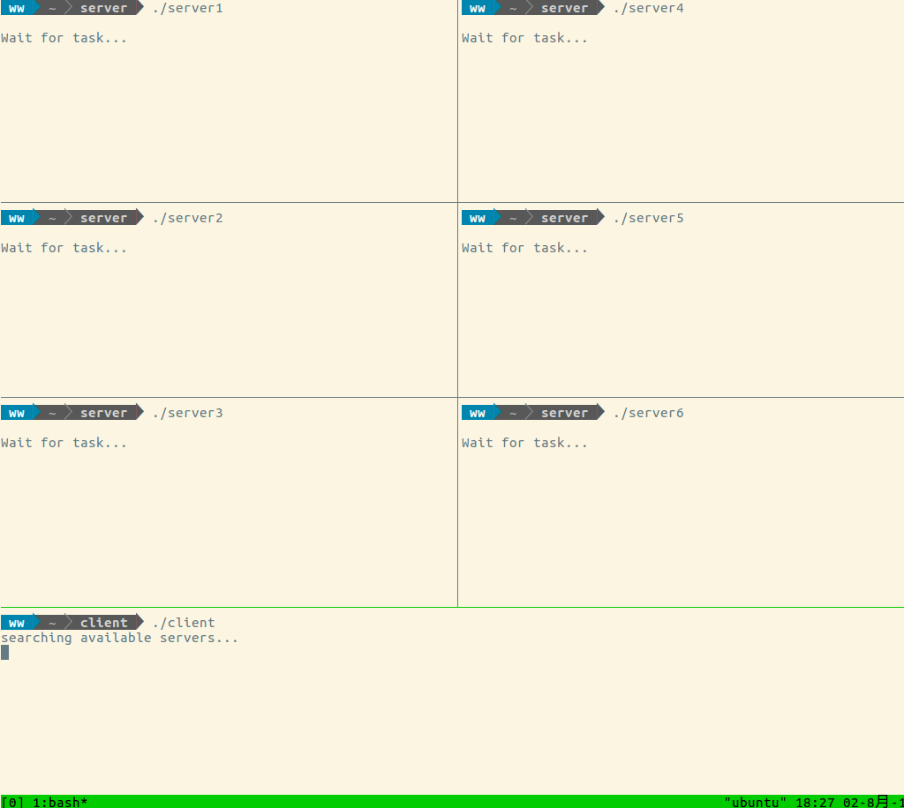
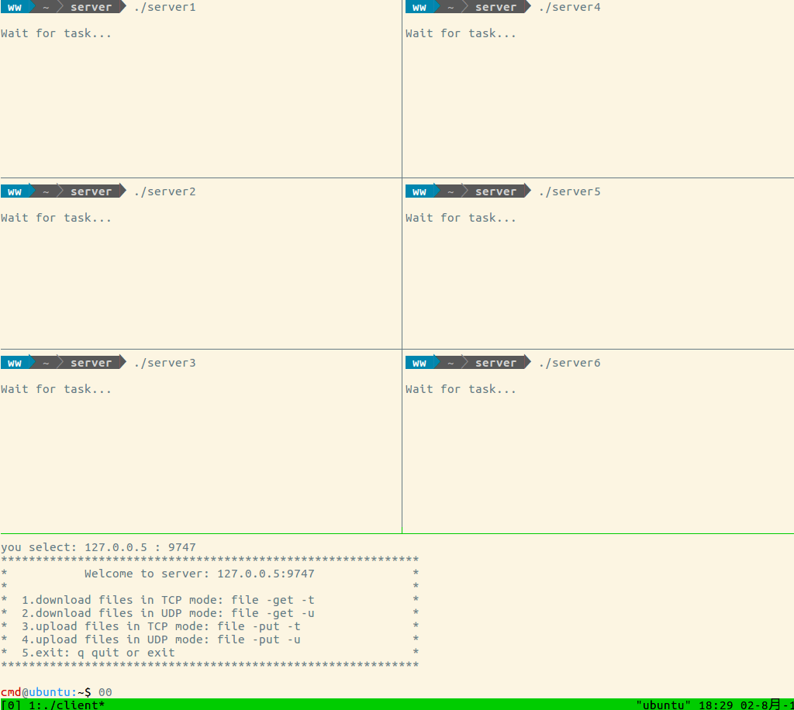
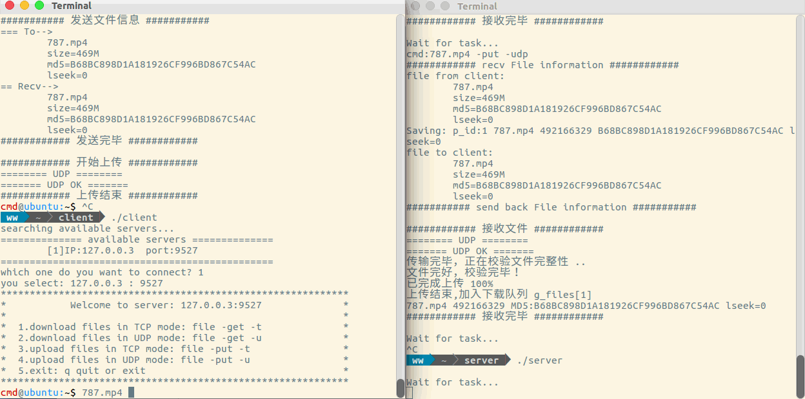
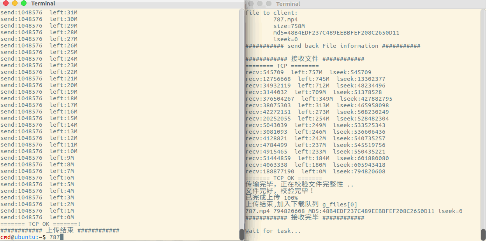
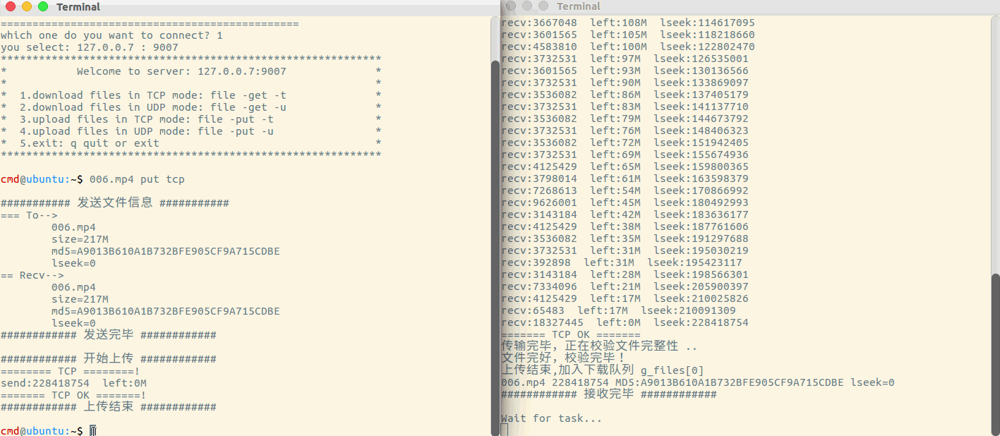

## 网络C/S文件传输工具

------------------------------------------

### 一、功能设计

1. 局域网探测

   服务器启动，首先开启一个线程每3秒向网段内4001端口广播自己的IP和端口号.

   客户端启动，监听4001端口，接收广播数据，保存可用的服务器供客户端选择。

   客户端搜索时间为5秒，5秒之后在终端打印可用服务器列表。

   输入序号即可连接相应的服务器。

2. 上传下载

   首先发送客户端命令至服务器，然后发送文件信息至服务器，服务器返回文件偏移位置。这两步采用`TCP`通信。文件读写采用`mmap`，减少内核态用户态的切换。

   **上传**：客户端根据服务器返回的`file.pos`定位到读位置，从该处读取并发送数据。服务器每接收一块数据就增加一条记录，客户端若是断开，再次上传前，把该位置传给客户端，客户端从该处继续上传。若文件上传完毕，则把该文件加入到下载队列中。

   **下载**：客户端发送请求给服务器，服务器从下载队搜索文件，把偏移量回传给客户端，文件若是不存在本次传输完毕。本次下载完毕，把`file.pos`重置归0.客户端会创建`download`文件夹用来存放下载文件。

   相同文件第二次传输时秒传。

   上传和下载有进度条显示。

3. `UDP/TCP`

    除非明确指定，否则传输方式默认为`TCP`。

    `TCP`传输方式采用`write`和`read`函数.

    `UDP`传输方式，代码结构上为了和`TCP`保持一致，封装了类似`write`的`send_by_udp`函数、类似`read`的`recv_by_udp`函数。这两个函数提供了`UDP`的可靠传输方案，每次发送`1024`字节长度(太大`IP`层会分包)，接收方回复一个确认序号`id`，发送方根据这个`id`选择是否重发。

    上传和下载的断点信息统一保存在服务器。

4. 文件校验

   采用MD5值比对的方式进行校验。上传时先把MD5值上传服务器，待上传结束，服务器立即计算此文件MD5值与客户端的MD5比对。下载时同理，客户端会计算下载完毕文件的MD5，与服务器上的比对。


##### 客户端命令:

为调试方便，模仿了终端，可以上下键历史命令和tab键自动补全，用realine库实现，
添加编译选项`-I /lib/x86_64-linux-gnu/ -lreadline`.
```
上传命令:
    $ file   put          //参数支持用-分割，也可直接输入
    $ file  -put          //第三参数为空时，默认TCP上传方式
    $ file   put  -tcp    //TCP上传，可简写为 file put t
    $ file  -put  -udp    //UDP上传，可简写为 file put u
下载命令：
    $ file  -get          //TCP下载
    $ file  -get  -tcp    //TCP下载，可简写为 file get t
    $ file  -get  -udp    //UDP下载，可简写为 file get u
退出命令:
    $ exit q quit
```

##### 代码结构:
```C
│─── bin                         //二进制生成路径
│     ├─ client  
│     └─ server  
│─── include                     //头文件以及md5和common的实现
│     ├─ md5.h
│     ├─ common.h                //客户端和服务端共用的一些函数和标准头文件
│     ├─ client_work.h
│     ├─ server_work.h
│     ├─ common.c
│     └─ md5.c
│─── client                       //客户端代码
│     ├─ client.c
│     └─ client_work.c
│─── server                       //服务端代码
│     ├─ server.c
│     └─ server_work.c
│─── pic                          //本文档用到的一些图片和gif动图
└─── makefile                     //编译脚本
```


### 二、gif动图演示和测试

##### (1)探测功能
client和server生成后放到不同的文件夹。
server生成6次，每次设定不同的IP和端口号，验证服务器搜索功能。




##### (2)传输功能

测试文件：`787.mp4`(492.2M)和`006.mp4`(228.4M).

测试四种传输方式和两种断点续传功能：

①`006.mp4`  &emsp;&emsp;*TCP*上传。

②`787.mp4`  &emsp;&emsp;*UDP*上传，上传途中我们断开客户端，同时验证断点续传功能。

③`787.mp4` &emsp;&emsp;*TCP*下载。

④`006.mp4` &emsp;&emsp;*UDP*下载，下载途中我们断开客户端，验证断点下载。


四种方式演示如下：

①`006.mp4`  &emsp;&emsp;*TCP*上传。

客户端命令:`006.mp4 -put -tcp`

我们可以看到客户端连接的为`server5`服务器，服务器接收文件后会校验该文件的完整性，校验完毕，加入下载队列。




至此，为了后续的演示清晰，我们关闭其余无用的`tmux`窗口。

②`787.mp4` &emsp;&emsp;*UDP*上传。

客户端命令:`787.mp4  -put  -udp`

断开客户端时上传到45%时，，然后重启客户端继续上传，我们看到程序从上次45%处继续上传。




③`787.mp4` &emsp;&emsp;*TCP*下载。

客户端命令:`787.mp4 -get -tcp`



④`006.mp4` &emsp;&emsp;*UDP*下载。

客户端命令:`006.mp4 -get -udp`

61%时断开客户端，重启时从61%处继续下载。



#####  局限

我们假设服务器不会挂掉、服务器初始状态无下载文件，所有文件都是经由客户端上传。
    
不具备并发性，只能一对一传输。

现阶段通过简单的偏移量`file.pos`实现的秒传，后续可以通过判断MD5值来实现秒传，比如`123.mp4`和`abc.mp4`实为同一文件，只是名字不同，上传时服务器保存一份，但是有两份记录(便于客户端通过文件名称检索)，下载时比如下载的是`123.mp4`服务器保存的是abc.mp4，这时服务器打开文件abc.mp4传输，客户端建立的文件名称还是`123.mp4`.可以在`fileinfo`结构体中增加一个`char targetfile[]`用来多个文件名映射一个实际的文件，下载时，根据这个变量打开文件传输。可以用脚本简化程序，用数据库管理上传下载文件。

